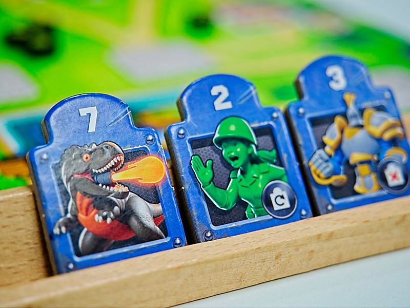
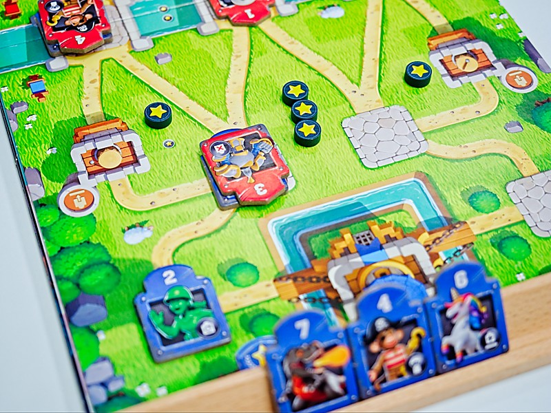
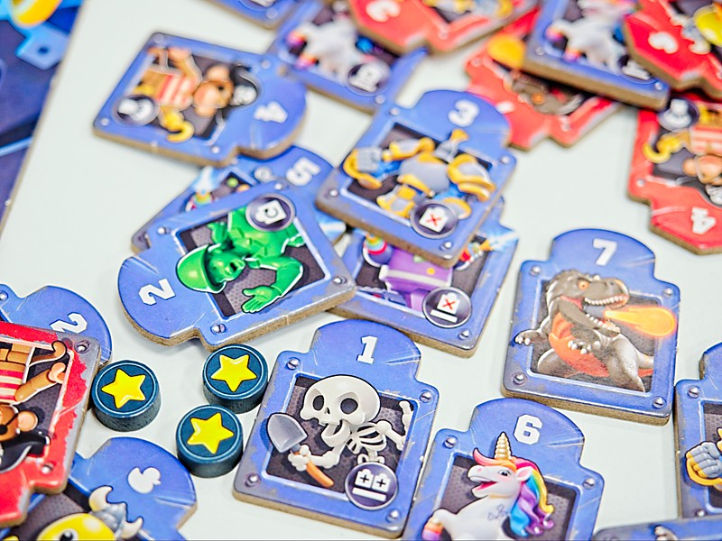
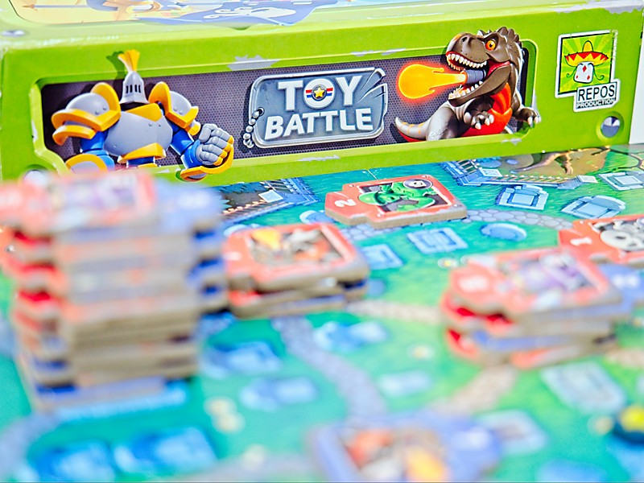

เกมแนวชิงพื้นที่สำหรับสองคนจากนักออกแบบที่มีผลงานยาวเป็นหางว่าว Ethons, Libertalia, Dogs of War, Match of the Century, Battalion: War of the Ancients, ...... มารอบนี้จะเป็นธีมสงครามของเหล่าของเล่น

ไอเดียเกมไม่ยุ่งยาก ผู้เล่นจะอยู่คนละฝั่งของแผนที่เป้าหมายคือส่งไทล์ยูนิทเราไปล้อมพื้นที่จนสะสมดาวได้ถึงจำนวนที่ฉากกำหนด หรือว่าวางไทล์ยูนิทเราเชื่อมต่อเรียงกันไปจนถึงปราสาทฝ่ายตรงข้ามได้

โดยไทล์ยูนิททั้งฝ่ายจะหน้าตาเหมือนกันบนหัวจะมีเลข 1-7 อย่างละ 3 copy (แต่มีสุ่มออกฝ่ายละ 4 ไทล์) เวลาเราเอาไทล์ไปวางก็จะมีสองท่าคือวางบนพื้นที่ว่างหรือเอาไปวางทับอีกฝ่ายถ้าเลขเราเยอะกว่า แต่ละไทล์ก็จะมีความสามารถประจำตัว ประมาณลงแล้วได้จั่วเพิ่ม , ลงแล้วคิลตัวข้างๆ, ลงแล้วได้เล่นอีกตาอะไรแนวๆนั้น

ทีนี้คุณอาจจะสงสัยงี้ลง 7 ยืนพื้นก็พอล่ะดิ? เกมมันเลยมีไทล์เป็ดที่นับเป็นโจ๊กเกอร์วางทับทุกเลขมาให้ด้วย แต่จุดอ่อนมันก็คือมันโดนอะไรทับก็ได้เหมือนกัน ที่เหลือเกมก็ไม่มีอะไรผู้เล่นเลือกแค่จะจั่วหรือลงไทล์สลับกันไปจนกว่าใครจะเข้าเงื่อนไขชนะ หรือถ้ามีคนไทล์หมดก็ให้นับแต้มดาวที่ยึดมาแทน

---
ส่วนที่ชอบของเกมนี้คือมันเป็นเกมสนุกที่สอนง่ายเล่นไวแล้วมีจังหวะลุ้นตลอดว่าแผนมันจะไปได้สวยไหม คือมันไม่ใช่เกมลงหมากวางแผนแห้งๆ เพราะมันมีมิติของการลงที่ว่างแล้วก็วางไทล์ทับเพื่อกรุยทางให้เราวางไทล์ต่อไปข้างหน้าอีก decision space / weight ทำออกมาได้สวย ไม่มีจังหวะไหนที่รู้สึกว่าต้องวางไทล์ส่งๆ แต่ก็ไม่เครียดปวดใจ

เกมให้แผนที่มา 8 แบบ แต่ละแบบก็จะมี layout กับ 'จุดพลังพิเศษ' ไม่เหมือนกัน บางฉากเวลาเอาตัวมาวางก็จะได้สิทธิ์ในการดึงตัวขึ้น บางฉากเป็นได้ชุบตัวฟรี บางฉากเป็นได้ผลักตัว อะไรแบบนั้น ทำให้มันมีจังหวะที่แตกต่างในแต่ละแผนที่ตอนเล่นไม่ได้รู้สึกว่าจืดๆเบื่อง่ายนะ

นึกข้อเสียไม่ออกแต่มีข้อที่แบบอยากให้เกมมันทำต่อ คือเกมนี้สองฝ่ายมันเท่ากัน ก็อยากให้เค้าทำพวกไทล์เลข 1-7 ที่มีความสามารถใหม่ๆ มาเพิ่มอีกหลายๆชนิดมาให้ผู้เล่นสลับจัดทัพใหม่เองก็คิดว่าน่าจะสนุกดี (ถ้าไม่ทำก็น่าก็อปเกมเค้ามาเติมเองอยู่นะ......มาคิดๆแล้วทำแนวไปฟาร์มมอนส์เอาทัพมาเติมในตี้ก็อาจจะน่าสนุกดี... ไปไกลละ)

---
🐸 ME - **กบโอเค** - เห้ยนี้มัน Clash Royale ..... สำหรับเกม 15 นาทีต่อ session แล้วเกมนี้ทำอารมณ์การเล่นแบบ tense ได้ดี ครั้งแรกคือเล่นไป 6 เกมติด คือมันมีฟีลของการจัดลำดับแย่งชิงพื้นที่กับการตัดสินใจว่าอยากจะชนะด้วยท่าไหนในระหว่างเล่นเกมที่เราต้องคิดแผนรับมือตลอด เท่าที่ลองเล่นมาคือแพ้ชนะกันในระดับ 'แม่งเอ๊ยถ้าตอนนั้นนะ......' คือแต่ละครั้งคือรู้สึกเลยล่ะว่ามันคือการวางแผนมาพร้อมกับดวงที่หนุนหลังมาหน่อยๆ (แต่ก็ไม่ขนาดแผนการพร้อมแต่ลมบูรพาไม่มาเลยแพ้นะ คือรู้สึกถึงความกำหมัดแบบ YES! เวลาชนะเกือบทุกครั้งเลย 

เรียกว่า recommanded สำหรับคนที่อยากได้เกมสองคนไวๆไว้คั่นเวลาละกันเพราะเกมมันเบาๆ interaction แม้จะบอกว่าเกมธีมตบตีกันแต่ตอนเล่นไม่ได้รู้สึกถึงความรุนแรงอะไรก็หยิบๆวางทับไปทับมาชิงพื้นที่มากกว่า 

🔴 expert  | 🟠 regular | 🟢casual/family | 🧸newbie : เกมผลัดกันยึดชิงพื้นที่ที่มีมิติน่าสนใจ เล่นง่ายแค่จั่วหรือลงไทล์แต่ด้วยลักษณะของพลังความสามารถ กับวิธีการชนะสองแบบที่ใกล้เคียงกันทั้งคู่ทำให้รูปแบบเกมเปลี่ยนไปมาตลอด ลุ้นทุกจั่ว

---
> 🐸 ME - ความเห็นส่วนตัวสำหรับตัวเองเพื่อตัวเอง
> 🔴 expert - ผ่านเกมมาเยอะ อ่านเกมใหม่ตลอด
> 🟠 regular - เล่นบ่อยเล่นประจำออกตระเวนเล่น
> 🟢casual/family - เล่นที่ร้านเล่นหรือกับครอบครัว
> 🧸newbie - มือใหม่พึ่งเข้าวงการผ่านเกมตามร้านมานิดหน่อย

---
==โพสนี้ไม่ได้มีการรับสินค้าและค่าตอบแทนใดๆ==  เกมมีวางขายแบบ EN แล้ว แต่พอดีผมไปเจอคนนำเข้าฉบับภาษาไทยแล้วเค้าชวนเล่นพอดี แต่คือถ้าอยากได้ฉบับคู่มือไทย (เพราะตัวเกมไม่ได้ใช้ภาษา) ไว้ฝากลูกหลานก็รอซื้อตัวไทยได้ปลายปีนี้ครับ

